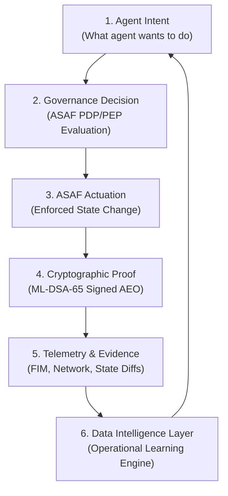

# KHEPRA Autonomous Agent Data Loop & Agentpack Specification

> **Authoritative Strategy & Architecture Spec**: Adapting Railway-style infrastructure primitives (CLI, Templates, Nixpacks/Agentpacks) with the ASAF Privileged Proof Plane and Autonomous Governance Data Loop.

---

## 1. Executive Summary & Category Definition

```
  Traditional Application Platforms (Railway / Vercel / Heroku)
  Developer Intent ──> Project Definition ──> Build Detection ──> Deployment ──> Runtime Signals ──> Optimization

  =============================================================================================================

  KHEPRA Autonomous Agent Governance Platform
  Agent Intent ──> Agentpack / Blueprint ──> Governance Evaluation ──> ASAF Actuation ──> PQC Proof (AEO) ──> Data Loop Learning
```

### The Category
**KHEPRA is the first infrastructure platform where autonomous agents are deployed like applications, but every privileged action produces cryptographically verifiable evidence (AEO) and continuously improves through operational feedback loops.**

Commodity cloud hosting (Railway, AWS, Hetzner, GCP) supplies execution. **KHEPRA supplies the Autonomous Governance Data Loop and Proof Plane.**

---

## 2. Infrastructure Alignment: Railway Primitives ➔ KHEPRA Evolution

| Railway Primitive (MIT Open Source) | KHEPRA Evolution | Purpose & Specification |
|---|---|---|
| **Railway CLI** (`railway up`) | **KHEPRA CLI / MCP** (`khepra deploy`) | Agent-friendly and human-friendly CLI for intent-driven deployment & governance. |
| **Railway Template** (`service: postgres, app`) | **Agent Blueprint** (`agentpack.yaml`) | Defines agent identity, tool capabilities, required ASAF policies, and PQC proof requirements. |
| **Nixpacks** (Source $\rightarrow$ Runnable Container) | **Agentpacks** (Agent Definition $\rightarrow$ Governed Runtime Artifact) | Detects agent framework (LangGraph, AutoGen, CrewAI), auto-generates security profiles, and packages container. |
| **Deployment Log** | **Autonomous Evidence Object (AEO)** | Cryptographically signed (ML-DSA-65) forensic record of state transitions, before/after hashes, and policy rulings. |

---

## 3. The `agentpack.yaml` Specification

`agentpack.yaml` is the canonical blueprint for deploying governed agents:

```yaml
agent:
  name: soc-investigator
  version: 1.0.0
  framework: langgraph

mission:
  detect:
    - vulnerabilities
    - infrastructure_anomalies
    - compliance_drift

tools:
  allowed:
    - github
    - kubernetes
    - cloudflare
    - hostinger

security:
  pqc_attestation: required # ML-DSA-65 (FIPS 204)
  policy_framework: CMMC_3_0_LEVEL_2
  containment:
    max_posture: PostureRestricted
    actions:
      allow:
        - read_logs
        - query_stig
      require_approval:
        - update_dns
        - deploy_worker
      deny:
        - delete_production_database
        - modify_iam_policy

proof:
  required:
    - ML_DSA_65
    - AEO_DAG_COMMIT
```

---

## 4. The KHEPRA Autonomous Data Loop Engine

The operational data loop is KHEPRA's long-term enterprise moat. Every agent state transition feeds the data loop:



### The Data Moat
Over time, KHEPRA's Data Intelligence Layer accumulates proprietary operational insights:
- Which agent models execute remediations safely.
- Which governance policies cause false-positive blockages.
- Which infrastructure state transitions carry high financial risk (Godfather FAIR model).
- Cross-environment reliability metrics across Railway, AWS, Hetzner, and Sovereign Air-Gapped clouds.

---

## 5. Broadened Patent & Category Claims

**USPTO Patent Expansion (USPTO #73565085)**:
- **Invention Scope**: *"A system and method for autonomous agents to perform governed state transitions across heterogeneous infrastructure environments while generating cryptographically verifiable evidence and continuously improving through operational feedback loops."*
- **Claims**:
  1. Multi-tenant interposition daemon with 5 graduated containment postures (`PostureNormal` to `PostureLocked`).
  2. Agentpack capability detection and automated security profile generation.
  3. ML-DSA-65 content-addressed Autonomous Evidence Object (AEO) DAG chain replay.
  4. Closed operational data feedback loop for autonomous agent governance optimization.
