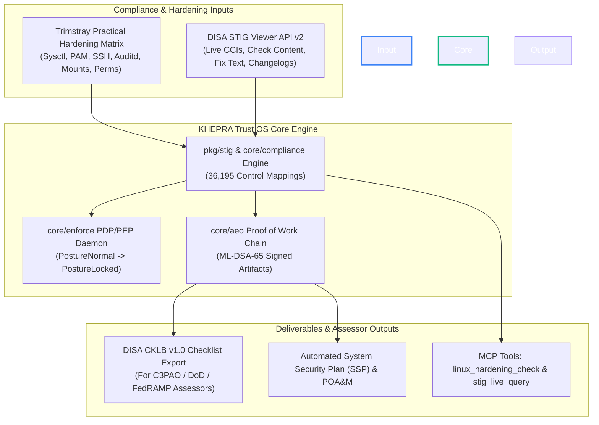

# Practical Linux Hardening & DISA STIG Viewer API Integration Architecture

This document specifies how **KHEPRA Trust OS** and **PQC-Khepra-MCP** leverage *The Practical Linux Hardening Guide* (Trimstray) alongside the DISA STIG Viewer API v2 to deliver automated, continuous Linux compliance, hardening, and cryptographic attestation.

---

## 1. Architectural Overview & Benefits



---

## 2. Benefit Breakdown: Practical Linux Hardening Guide

*The Practical Linux Hardening Guide* provides real-world production configurations that bridge the gap between static compliance checklists and active host defense:

| Domain | Hardening Rule | STIG / NIST Mapping | KHEPRA Enforcement Action |
|---|---|---|---|
| **Kernel & Sysctl** | Disable IP forwarding, ICMP redirects, source routing, enable ASLR & `kernel.unprivileged_bpf_disabled=1` | SV-257778 (RHEL-09-211015) / AC-6, SC-7 | `syschecks.go` validates `/etc/sysctl.d/`; violation triggers `PostureElevated`. |
| **Authentication & PAM** | Enforce strong password complexity (`pam_pwquality`), tally lockout (`pam_faillock`), disallow empty passwords | SV-257780 / AC-7, IA-5 | `remediator.go` verifies PAM config; violation holds execution for approval. |
| **SSH Server Hardening** | `Protocol 2`, `PermitRootLogin no`, `MaxAuthTries 3`, `AllowTcpForwarding no`, PQC key algorithms | SV-257785 / IA-2, SC-13 | `rhel09_stig_check` validates SSH daemon config; failure flags unauthenticated risk. |
| **Filesystem Security** | Set `nodev`, `nosuid`, `noexec` on `/tmp`, `/var/tmp`, `/dev/shm`; enforce restrictive umask `027`/`077` | SV-257790 / CM-6, CM-7 | Host collector inspects `/etc/fstab` and mount tables; violation reported in AEO. |
| **Audit & Logging** | `auditd` active with immutable flag (`-e 2`), monitoring `/etc/passwd`, `/etc/shadow`, binary executions | SV-257795 / AU-2, AU-12 | AEO recorder verifies audit logs match event hashes. |

---

## 3. Benefiting from the STIG Viewer API v2 (`pkg/stig/live_fetch.go`)

Our codebase includes a live client for the DISA STIG Viewer API in [`pkg/stig/live_fetch.go`](file:///Applications/Whitebox/PQC-Khepra-MCP/pkg/stig/live_fetch.go):

1. **Zero-Delay Benchmark Updates (`GET /stigs/changelog`)**:
   - Automatically tracks when DISA releases new STIG revisions (e.g., RHEL 9 V2R9, RHEL 10 V1R2, WinServer 2022 V2R9) without needing a binary rebuild.
2. **Multi-CCI CMMC Audit Trail (`ruleIdents[]`)**:
   - Captures the complete array of Control Correlation Identifiers (CCIs) for every rule, mapping directly to NIST SP 800-53 Rev 5 and CMMC 3.0 Level 2/3 controls.
3. **Official Fix Text Ingestion (`GET /stigs/{slug}/download`)**:
   - Retrieves official DISA remediation scripts and fix texts for automated host remediation (`remediator.go`).
4. **DISA CKLB v1.0 Checklist Generation (`DownloadCKLB`)**:
   - Generates machine-readable CKLB XML/JSON files that C3PAO assessors load directly into DISA STIG Viewer 3.x.

---

## 4. MCP Server Integration & Agent Tools

We expose live STIG and Linux Hardening capabilities directly to AI agents via two dedicated tools:

```json
{
  "tools": [
    {
      "name": "linux_hardening_check",
      "description": "Run real-time Linux host hardening checks against Trimstray Practical Hardening rules and DISA RHEL 9/10 benchmarks.",
      "inputSchema": {
        "type": "object",
        "properties": {
          "domain": { "type": "string", "enum": ["all", "kernel", "ssh", "pam", "filesystem", "audit"] }
        }
      }
    },
    {
      "name": "stig_live_query",
      "description": "Query the live DISA STIG Viewer API for updated rules, CCIs, NIST crosswalks, check contents, and fix texts.",
      "inputSchema": {
        "type": "object",
        "properties": {
          "slug": { "type": "string", "default": "red_hat_enterprise_linux_9" },
          "severity": { "type": "string", "enum": ["high", "medium", "low"] }
        }
      }
    }
  ]
}
```
