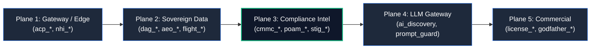

# Comprehensive Tool Survey & Migration Audit: PQC-Khepra-MCP to Khepra-Core

> Authoritative audit of all 75+ tools in `PQC-Khepra-MCP` and the migration trajectory to `khepra-trust-os/core` under the convergence plan ([ARCH-010](ARCH-010-convergence-and-public-split.md)).

---

## 1. Landed & Active Tools in `khepra-trust-os/core` (13 Tools)

These tools are currently live and self-contained in `core/`:

| Tool | Core Package | Domain | Status |
|---|---|---|---|
| `agent_register` | `core/aeo` | Identity & Minting | ✅ Landed |
| `aeo_record` | `core/aeo` | Evidence Graph (`khepra-aeo/1.0`) | ✅ Landed |
| `aeo_verify` | `core/aeo` | Cryptographic Proof & Signature Verification | ✅ Landed |
| `ledger_replay` | `core/aeo` | Forensic Chain Replay (Genesis-to-Tip) | ✅ Landed |
| `trust_score` | `core/aeo` | 0-100 Trust Score Calculation | ✅ Landed |
| `passport_issue` | `core/citizenship` | Agent Passport Issuance (`khepra-passport/1.0`) | ✅ Landed |
| `passport_verify` | `core/citizenship` | Passport Verification against Ledger | ✅ Landed |
| `dual_anchor` | `core/mcp` | Dual-Anchor Transport Determinism & Drift Proof | ✅ Landed |
| `ledger_stats` | `core/mcp` | Aggregate Traction Metrics | ✅ Landed |
| `scan_shadow_ai` | `core/aidiscovery` | Shadow AI Asset & Port Discovery | ✅ Landed |
| `attest_ai_policy` | `core/aidiscovery` | Governance Policy Evaluator & Posture Mapping | ✅ Landed |
| `linux_hardening_check` | `core/mcp` | Trimstray Practical Hardening Host Checks | ✅ Landed |
| `stig_live_query` | `core/mcp` | Live DISA STIG Viewer API v2 Query Engine | ✅ Landed |

---

## 2. Survey & Migration Trajectory (5 Planes)

Per `core/README.md`, tools migrate from `PQC-Khepra-MCP` to `khepra-trust-os/core` across 5 structured planes:

### Plane 1: Non-Human Identity & Access Control (`core/citizenship` & `core/acp`)
- **Tools to Migrate**:
  - `acp_status`, `acp_issue`, `acp_revoke` (Agent Control Plane token management).
  - `nhi_inventory`, `nhi_orphans`, `nhi_excessive`, `nhi_expired`, `nhi_revoke` (Non-Human Identity lifecycle).
- **Target Package**: `core/citizenship/acp`
- **Value**: Prevents credential sprawl and enforces agent capability token expiration.

### Plane 2: Sovereign Data & Forensic Integrity (`core/evidence` & `core/forensics`)
- **Tools to Migrate**:
  - `forensic_snapshot` (Full memory and process snapshot).
  - `fim_baseline` (File Integrity Monitoring with SHA-256 / lattice hashes).
  - `audit_dag_integrity` (Cross-check DAG anchor store against host logs).
  - `flight_record`, `flight_export` (SouHimBou AI Flight Recorder telemetry).
- **Target Package**: `core/evidence/forensics`
- **Value**: Powers post-incident forensic replay and proof-of-non-tampering.

### Plane 3: Compliance Intelligence & Assessment (`core/compliance`)
- **Tools to Migrate**:
  - `cmmc_assess` (CMMC Level 1, 2, 3 maturity scoring & SSP generation).
  - `khepra_export_attestation`, `khepra_export_poam` (C3PAO intake packages & Plan of Action and Milestones).
  - `stig_check`, `khepra_query_stig`, `nist_map` (36,195 cross-framework control queries).
  - `godfather_report`, `godfather_approve` (Executive board-level risk reports).
- **Target Package**: `core/compliance`
- **Value**: Core commercial engine for CMMC/NIST compliance automation.

### Plane 4: Vulnerability & Threat Intelligence (`core/scanner`)
- **Tools to Migrate**:
  - `ert_scan`, `ert_readiness`, `ert_architect`, `ert_crypto` (Enterprise Risk & Threat scanning).
  - `secret_scan`, `container_scan`, `attack_graph`, `sbom_generate` (Software supply chain defense).
  - `threat_lookup`, `drift_detect`, `ir_incident`, `ir_add_ioc` (Incident Response).
- **Target Package**: `core/compliance/scanner`
- **Value**: Automated attack surface discovery and vulnerability prioritization.

### Plane 5: Commercial Licensing & Key Ceremony (`core/commercial`)
- **Tools to Migrate**:
  - `issue_license`, `service_token`, `verify_sovereign_license`.
- **Target Package**: `core/commercial`
- **Value**: Commercial licensing gate and Sacred Runes key management.

---

## 3. Public Kernel Tool Allocation (`PQC-Khepra-MCP`)

The following tools will remain in `PQC-Khepra-MCP` as open-source national security contributions:

1. `pqc_stig`: World's First DoD PQC STIG (drives public adoption).
2. `owasp_agent_assess`: OWASP Agentic Top 10 vulnerability assessment.
3. `nist_map`: Public NIST SP 800-53 control lookup.
4. `dark_crypto_contribute`: Privacy-preserving community quantum telemetry.
5. `scan_shadow_ai`: Basic single-host AI port scan.
